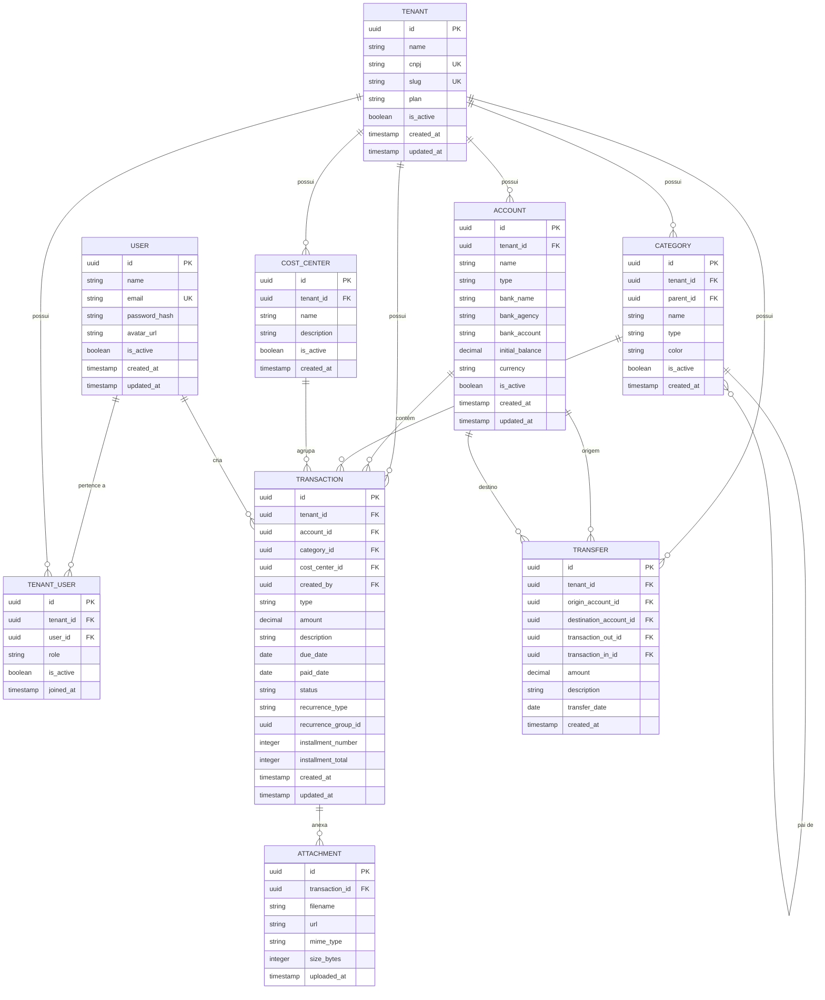

# ERD — Diagrama Entidade-Relacionamento

**Projeto:** FinPME  
**Versão:** 1.0  
**Data:** 2026-06-25

---

## Diagrama (Mermaid)

---

## Descrição das Entidades

### USER
Usuário da plataforma. Um usuário pode pertencer a múltiplos tenants (empresas).

### TENANT
Empresa/organização. Unidade de isolamento de dados (multi-tenancy).  
`role` em TENANT_USER: `admin`, `financial`, `operational`.

### ACCOUNT
Conta bancária, carteira ou caixa de uma empresa.  
`type`: `checking` | `savings` | `cash` | `investment`.

### CATEGORY
Plano de contas hierárquico.  
`type`: `income` | `expense`.  
Suporta categorias pai/filho (ex: "Despesas Operacionais" > "Aluguel").

### COST_CENTER
Centro de custo para agrupamento gerencial de transações.

### TRANSACTION
Lançamento financeiro (entrada ou saída).  
- `type`: `income` | `expense`  
- `status`: `pending` | `paid` | `cancelled`  
- `recurrence_type`: `none` | `daily` | `weekly` | `monthly` | `yearly`  
- Lançamentos parcelados compartilham o mesmo `recurrence_group_id`.

### TRANSFER
Transferência entre duas contas do mesmo tenant.  
Gera dois registros em TRANSACTION (um débito e um crédito) vinculados por `transaction_out_id` e `transaction_in_id`.

### ATTACHMENT
Arquivo comprovante vinculado a uma transação (nota fiscal, recibo, etc.).

---

## Notas de Implementação

- **Row-Level Security (RLS):** todas as tabelas com `tenant_id` devem ter políticas RLS habilitadas no PostgreSQL.
- **Soft delete:** entidades críticas (ACCOUNT, CATEGORY, TRANSACTION) usam `is_active = false` em vez de DELETE físico.
- **Auditoria:** considerar tabela `audit_log` para registrar mudanças em transações no futuro.
