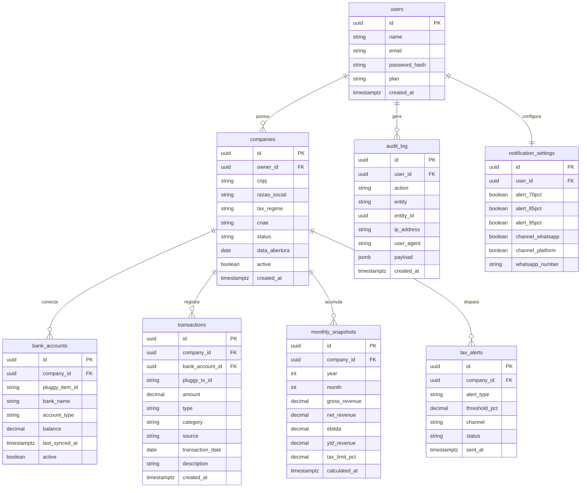

# Diagrama ER — FinPME

**Versão:** 1.0  
**Data:** Junho 2026  
**Autor:** Pedro Vitor  

---

## Diagrama

---

## Descrição das tabelas

| Tabela | Descrição |
|---|---|
| `users` | Usuários do sistema (donos de empresa e contadores) |
| `companies` | Empresas cadastradas — uma por CNPJ, vinculada a um `owner_id` |
| `bank_accounts` | Contas bancárias conectadas via Open Finance (Pluggy) |
| `transactions` | Entradas e saídas financeiras — manuais ou importadas via Pluggy |
| `monthly_snapshots` | Métricas mensais pré-calculadas (EBITDA, YTD, % do limite) |
| `tax_alerts` | Histórico de alertas tributários enviados por empresa |
| `audit_log` | Log de auditoria de todas as ações sensíveis do usuário |
| `notification_settings` | Preferências de notificação por usuário (1:1 com users) |

---

## Notas de design

- **`pluggy_tx_id`** em `transactions` tem constraint `UNIQUE` — garante idempotência na importação de extratos bancários.
- **`bank_account_id`** em `transactions` é nullable — é `NULL` para transações inseridas manualmente, preenchido apenas para transações importadas via Pluggy.
- **`monthly_snapshots`** armazena métricas pré-calculadas para evitar recálculo em tempo real no dashboard. Recalculado diariamente às 02h pelo `NightlySnapshotJob`.
- **`active`** em `companies` e `bank_accounts` implementa soft delete — registros nunca são removidos fisicamente.
- **`notification_settings`** é 1:1 com `users` — criada automaticamente no cadastro do usuário com valores padrão.
- **`audit_log.payload`** é `jsonb` — armazena os dados relevantes da ação (ex: campos alterados, valores antes/depois).
